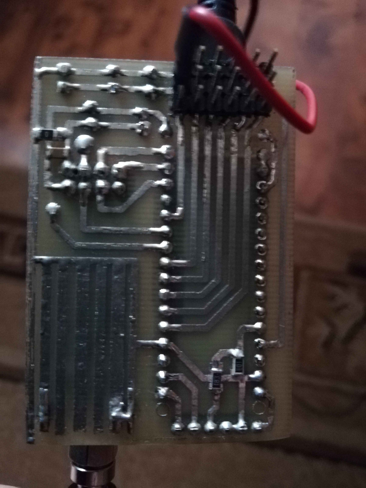

# Futaba M series 6 remaster

Old and damaged flight controller transmitter - Futaba 6 - given new life using digital technology. Uses ESP32-S3, NRF24L01 radio and ST7735S 80x160 display with Arduino framework in PlatformIO. Transmitting to Arduino Nano to control servos. Created for my dad.

<!----------------------------------------------------------------------------->

## Hardware

### Transmitter

Case: Old "RipMax M Series Futaba 6" controller (transmitter) case with 5 potentiometers, 3 switches and 1 button. Plus power switch.([Example of ideal state on YT](https://www.youtube.com/watch?v=x7WQ4WjylRU)) 
Microprocessor: ESP32-S3 N16R8 _(obviously overkill, but whatever, dads idea)_. ([Amazon](https://www.amazon.com/-/es/ESP32-S3-ESP32-S3-DevKit-Bluetooth-Internet-Desarrollo/dp/B0CDWXWXCG)) 
Radio: NRF24L01.([Amazon](https://www.amazon.com/Makerfire-Arduino-NRF24L01-Wireless-Transceiver/dp/B00O9O868G)) 
Display: ST7735S 80x160.([Amazon](https://www.amazon.com/ST7735S-Serial-Display-Controller-Controller/dp/B0C6D5XK2B)) 

#### Photos

<table>
	<tbody>
		<tr>
			<td colspan=2 rowspan=2></td>
			<td></td>
		</tr>
		<tr>
			<td></td>
		</tr>
	</tbody>
</table>

<!-- TODO: nice table with pins -->

#### Schematic

### Receiver

For now some Arduino Nano with another NRF24L01P is used. No pins listed, no schematic, but photos are fairly simple.

<!-- TODO: nice table with pins, schematic... -->

#### Photos

<table>
	<tbody>
		<tr>
			<td colspan=2 rowspan=2></td>
			<td rowspan=2></td>
		</tr>
	</tbody>
</table>

<!----------------------------------------------------------------------------->

## Software

+ Project managed by [PlatformIO](https://platformio.org).
+ Framework: [Arduino](https://docs.platformio.org/en/latest/frameworks/arduino.html). _(both transmitter and receiver)_
+ Libraries:
	+ [Adafruit ST7735 library](https://github.com/adafruit/Adafruit-ST7735-Library) (and dependencies, like [Adafruit GFX](https://github.com/adafruit/Adafruit-GFX-Library)) _(transmitter only)_
	+ [RF24 library](https://github.com/nRF24/RF24) _(both transmitter and receiver)_
	+ [Arduino Servo library](https://www.arduino.cc/reference/en/libraries/servo/) _(receiver only)_
+ Transmitter reads state from the controls via potentiometers, using analog inputs. The values are normalized and transformed to precalculated values for receiver use, like number of microseconds to control the servos. That way the receiver doesn't need to be configured - at least for now.
+ Transmitter presents user with simple UI on the small display, split into pages which can be changed with the button. Some pages are hidden as "advanced", requiring user to hold the button during power-on to enable them.
+ The pages:
	+ Info - presenting batteries (both transmitter and receiver) and signal strength rating.
	+ Raw - presenting raw analog values, debug purposes.
	+ Centered - presenting values with bias/offset, zero in configured position; useful for physical axis calibration.
	+ Calibrate - allowing to configure analog min/center/max reference values on each control, using microseconds min/center/max for the servos for the receiver.
	+ Reverse - allowing to reverse the channels.
+ Status packet is requested from the receiver in set intervals, to inform the user about battery voltage and signal strength rating.
+ There is no clear signal strength value when working with the RF24 chip, so special "rating" value is calculated, taking into the account:
	+ Count of good/weak probes, using `testRPD()` which returns boolean: whether a signal (carrier or otherwise) greater than or equal to -64dBm is present on the channel.
	+ Count of expected signal packets in given interval.
	+ Latency/time since last status packet.
	+ Again: the "rating" value is scuffed and not very useful, but it's better than nothing.
+ EEPROM is used to store some configuration. Default values are specific to my unit.

<!----------------------------------------------------------------------------->

## Notes

Interesting:
+ https://community.platformio.org/t/new-esp32-s3-n16r8/41568/4
+ https://electronoobs.com/eng_robotica_tut4_2.php
+ https://github.com/atomic14/esp32-s3-pinouts

### To do

+ "Hello" packet: transmitter asking for receiver, receiver accepts.
+ Automatic raw values calibration (moving stick to get min/max, and use mid as center).
+ Update README to be actually useful and nice.
+ Get rid of warnings from 3rd party code.
